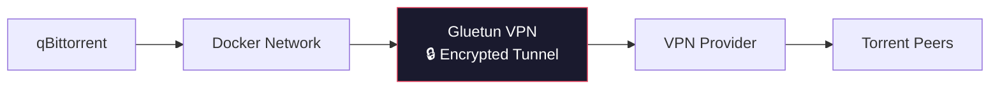

<div align="center">

# 🏠 Media Server

  A production-ready, self-hosted media automation stack

[](#)

</div>

---

## 📋 Table of Contents

- [Services](#-services)
- [VPN Architecture](#-vpn-architecture)
- [Environment Variables](#️-environment-variables)
- [Installation](#-installation)
- [Service Integration Flow](#-service-integration)
- [Useful Docker Commands](#️-useful-docker-commands)
- [Security Recommendations](#-security-recommendations)
- [Future Improvements](#-future-improvements)
- [Troubleshooting](#-troubleshooting)
- [Resource Usage](#-resource-usage-typical)


---

## 🐳 Services

| Service | Purpose |
|---|---|
| **Jellyfin** | Media streaming |
| **Jellyseerr** | Media requests |
| **Sonarr** | TV automation |
| **Radarr** | Movie automation |
| **Prowlarr** | Indexer management |
| **qBittorrent** | Download client |
| **Gluetun** | VPN gateway |
| **Bazarr** | Subtitle automation |
| **Watchtower** | Automatic updates |
| **Portainer** | Docker UI |

---


## 🔒 VPN Architecture

All torrent traffic passes **exclusively** through Gluetun.



---

## ⚙️ Environment Variables

Create `.env` from `.env.example`:

```env
TZ=Asia/Kolkata

PUID=1000
PGID=1000

CONFIG_PATH=/srv/configs
MEDIA_PATH=/srv/media
DOWNLOAD_PATH=/srv/downloads

# Gluetun
VPN_SERVICE_PROVIDER=your-provider
VPN_TYPE=wireguard

WIREGUARD_PRIVATE_KEY=
WIREGUARD_ADDRESSES=

SERVER_COUNTRIES=India
```

---

## 🚀 Installation

**1. Clone the repository**

```bash
git clone https://github.com/<username>/media-server.git
cd media-server
```

**2. Configure environment**

```bash
cp .env.example .env
# then edit .env with your values
```

**3. Start the stack**

```bash
docker compose up -d
```

<details>
<summary><strong>Other lifecycle commands</strong></summary>

```bash
# Stop
docker compose down

# Restart
docker compose restart

# Update containers
docker compose pull
docker compose up -d
```

</details>


---

## 🛠️ Useful Docker Commands

| Task | Command |
|---|---|
| Running containers | `docker ps` |
| View logs | `docker logs jellyfin` / `docker logs qbittorrent` / `docker logs gluetun` |
| Restart one service | `docker compose restart jellyfin` |
| Pull latest images | `docker compose pull` |
| Recreate containers | `docker compose up -d` |
| Docker disk usage | `docker system df` |
| Clean unused images | `docker image prune` |
| Host disk usage | `df -h` |


---

## 🔐 Security Recommendations

- 🚫 Never expose qBittorrent directly to the internet
- 🔒 Route all torrent traffic through Gluetun
- 🛡️ Use WireGuard whenever supported
- 🔄 Keep all Docker images updated
- 🔑 Use strong passwords
- 🌐 Enable HTTPS through a reverse proxy
- 🚧 Restrict external access
- 🗝️ Store secrets in `.env`

---

## 🚀 Future Improvements

- [ ] Nginx Proxy Manager
- [ ] Homepage dashboard
- [ ] Tailscale remote access
- [ ] Cloudflare Tunnel
- [ ] Grafana
- [ ] Prometheus
- [ ] Loki
- [ ] Uptime Kuma
- [ ] Immich
- [ ] Automatic backups
- [ ] SSD health monitoring
- [ ] Discord notifications

---

## ❗ Troubleshooting

<details>
<summary><strong>Container won't start</strong></summary>

```bash
docker logs <container-name>
```

</details>

<details>
<summary><strong>Permission issues</strong></summary>

```bash
sudo chown -R 1000:1000 configs/
```

Verify:
- `PUID` / `PGID`
- Folder ownership

</details>

<details>
<summary><strong>Jellyfin cannot see media</strong></summary>

Verify:
- Volume mappings
- Folder permissions
- Library configuration

</details>

<details>
<summary><strong>Sonarr/Radarr import issues</strong></summary>

Check:
- Download paths
- Remote path mapping
- Completed download handling

</details>

<details>
<summary><strong>VPN not connected</strong></summary>

```bash
docker logs gluetun
```

Verify:
- WireGuard credentials
- VPN provider
- Firewall rules
- Internet connectivity

</details>

---

## 📈 Resource Usage (Typical)

| Service | RAM | CPU |
|---|---:|---:|
| Jellyfin | 300–500 MB | Low |
| Jellyseerr | 150–250 MB | Very Low |
| Sonarr | 250–400 MB | Low |
| Radarr | 250–400 MB | Low |
| Prowlarr | 150–250 MB | Very Low |
| qBittorrent | 150–300 MB | Low |
| Gluetun | 50–100 MB | Very Low |
| Docker Overhead | ~200 MB | Minimal |

> **Typical idle RAM usage: 2–3 GB**


