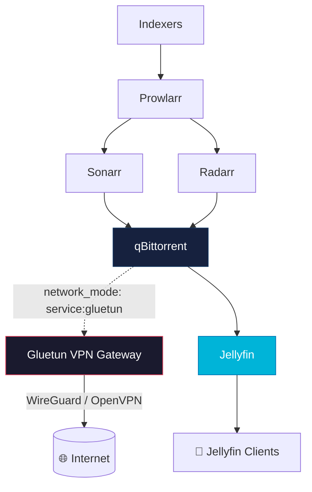
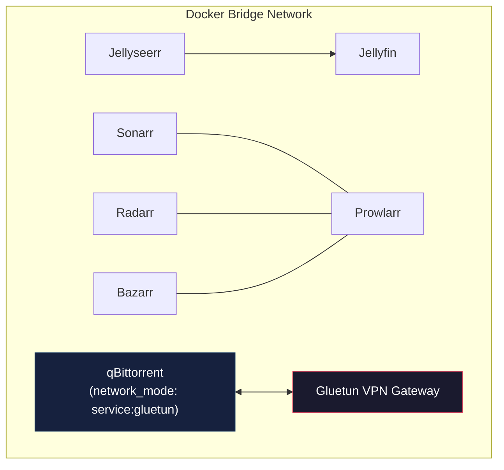
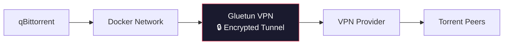
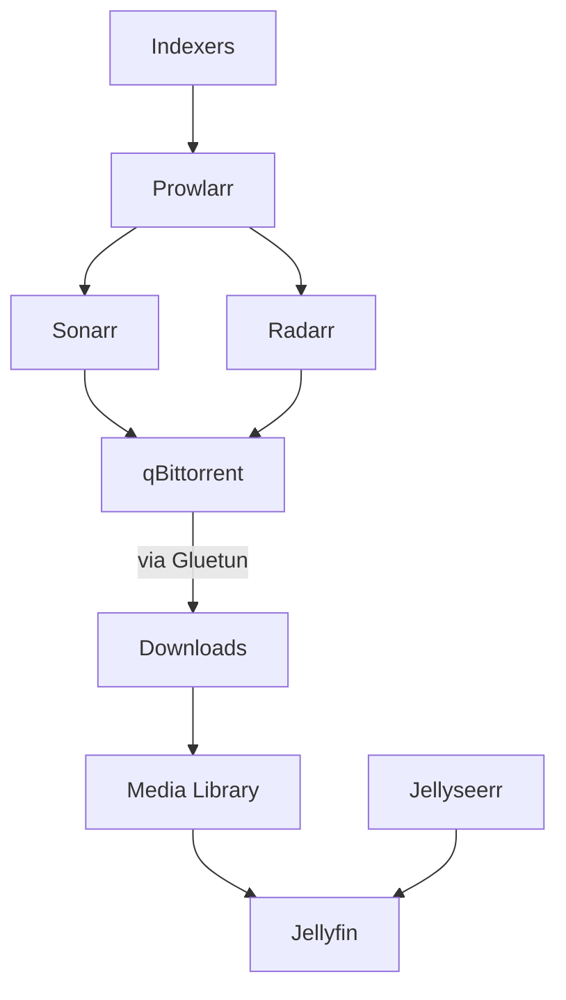

<div align="center">

# 🏠 Raspberry Pi 5 Media Server

**A production-ready, self-hosted media automation stack for the Raspberry Pi 5 (8GB)**

Docker Compose · Jellyfin · Sonarr · Radarr · Prowlarr · qBittorrent · Gluetun VPN

[](#)
[](#)
[](#)
[](#-license)

</div>

---

## 📋 Table of Contents

- [Features](#-features)
- [Architecture](#️-architecture)
- [Repository Structure](#-repository-structure)
- [Hardware](#️-hardware)
- [Services](#-services)
- [Network Architecture](#-network-architecture)
- [VPN Architecture](#-vpn-architecture)
- [Media & Downloads Layout](#-media-layout)
- [Volume Mapping](#-volume-mapping)
- [Environment Variables](#️-environment-variables)
- [Installation](#-installation)
- [Startup Order](#-startup-order)
- [Service Integration Flow](#-service-integration)
- [Useful Docker Commands](#️-useful-docker-commands)
- [Backup Strategy](#-backup-strategy)
- [Security Recommendations](#-security-recommendations)
- [Future Improvements](#-future-improvements)
- [Troubleshooting](#-troubleshooting)
- [Resource Usage](#-resource-usage-typical)
- [License](#-license)
- [Acknowledgements](#️-acknowledgements)

---

## ✨ Features

| | | |
|---|---|---|
| 🎬 **Jellyfin** — Media streaming | 🔍 **Jellyseerr** — Request management | 🎞️ **Radarr** — Movie automation |
| 📺 **Sonarr** — TV automation | 🌐 **Prowlarr** — Indexer management | ⬇️ **qBittorrent** — Download client |
| 🔒 **Gluetun** — VPN gateway (WireGuard/OpenVPN) | 📝 **Bazarr** — Subtitle automation *(optional)* | 🔄 **Watchtower** — Auto-updates *(optional)* |
| 🖥️ **Portainer** — Docker management *(optional)* | 🔐 Secure VPN kill switch | 💾 Persistent volumes & easy backup/restore |

> Lightweight, organized, and optimized to run comfortably on a Raspberry Pi 5.

---

## 🏗️ Architecture



---

## 📁 Repository Structure

```text
media-server/
├── README.md
├── LICENSE
├── .env.example
├── docker-compose.yml
│
├── compose/
│   ├── gluetun.yml
│   ├── qbittorrent.yml
│   ├── prowlarr.yml
│   ├── sonarr.yml
│   ├── radarr.yml
│   ├── bazarr.yml
│   ├── jellyfin.yml
│   ├── jellyseerr.yml
│   ├── watchtower.yml
│   └── portainer.yml
│
├── configs/            # Per-service persistent config
├── media/              # movies / tv / anime / music / photos
├── downloads/           # complete / incomplete / torrents
├── backups/
│
├── scripts/
│   ├── backup.sh
│   ├── restore.sh
│   ├── update.sh
│   └── healthcheck.sh
│
└── docs/
    ├── installation.md
    ├── networking.md
    ├── vpn.md
    ├── backups.md
    ├── upgrades.md
    └── troubleshooting.md
```

---

## 🖥️ Hardware

| Component | Recommendation |
|---|---|
| 🍓 Raspberry Pi | Pi 5 (8GB) |
| 💽 OS | Raspberry Pi OS Lite (64-bit) |
| 💾 Storage | 64GB SSD or NVMe |
| 🗄️ Media Storage | External SSD/HDD |
| ❄️ Cooling | Active Cooler |
| 🔌 Network | Gigabit Ethernet |
| ⚡ Power Supply | Official 27W USB-C |

---

## 🐳 Services

| Service | Purpose |
|---|---|
| **Jellyfin** | Media streaming |
| **Jellyseerr** | Media requests |
| **Sonarr** | TV automation |
| **Radarr** | Movie automation |
| **Prowlarr** | Indexer management |
| **qBittorrent** | Download client |
| **Gluetun** | VPN gateway |
| **Bazarr** | Subtitle automation |
| **Watchtower** | Automatic updates |
| **Portainer** | Docker UI |

---

## 🌐 Network Architecture



---

## 🔒 VPN Architecture

All torrent traffic passes **exclusively** through Gluetun.



**Benefits:**

- ✅ VPN kill switch
- ✅ DNS leak protection
- ✅ IPv6 leak protection
- ✅ Automatic VPN reconnect
- ✅ Secure torrent traffic
- ✅ No direct internet access for qBittorrent

---

## 📂 Media Layout

```text
media/
├── movies/
│   └── Movie Name (2026)/
│       └── Movie.mkv
├── tv/
│   └── Show Name/
│       ├── Season 01/
│       └── Season 02/
├── anime/
├── music/
└── photos/
```

## 📦 Downloads Layout

```text
downloads/
├── complete/
├── incomplete/
└── torrents/
```

---

## 💾 Volume Mapping

| Host Path | Container Path |
|---|---|
| `configs/` | `/config` |
| `downloads/` | `/downloads` |
| `media/movies` | `/movies` |
| `media/tv` | `/tv` |
| `media/music` | `/music` |

---

## ⚙️ Environment Variables

Create `.env` from `.env.example`:

```env
TZ=Asia/Kolkata

PUID=1000
PGID=1000

CONFIG_PATH=/srv/configs
MEDIA_PATH=/srv/media
DOWNLOAD_PATH=/srv/downloads

# Gluetun
VPN_SERVICE_PROVIDER=your-provider
VPN_TYPE=wireguard

WIREGUARD_PRIVATE_KEY=
WIREGUARD_ADDRESSES=

SERVER_COUNTRIES=India
```

---

## 🚀 Installation

**1. Clone the repository**

```bash
git clone https://github.com/<username>/media-server.git
cd media-server
```

**2. Configure environment**

```bash
cp .env.example .env
# then edit .env with your values
```

**3. Start the stack**

```bash
docker compose up -d
```

<details>
<summary><strong>Other lifecycle commands</strong></summary>

```bash
# Stop
docker compose down

# Restart
docker compose restart

# Update containers
docker compose pull
docker compose up -d
```

</details>

---

## 🔄 Startup Order

1. Gluetun
2. qBittorrent
3. Prowlarr
4. Sonarr
5. Radarr
6. Bazarr
7. Jellyfin
8. Jellyseerr
9. Watchtower
10. Portainer

---

## 🔗 Service Integration



---

## 🛠️ Useful Docker Commands

| Task | Command |
|---|---|
| Running containers | `docker ps` |
| View logs | `docker logs jellyfin` / `docker logs qbittorrent` / `docker logs gluetun` |
| Restart one service | `docker compose restart jellyfin` |
| Pull latest images | `docker compose pull` |
| Recreate containers | `docker compose up -d` |
| Docker disk usage | `docker system df` |
| Clean unused images | `docker image prune` |
| Host disk usage | `df -h` |

---

## 💾 Backup Strategy

**Back up regularly:**

- `configs/`
- `docker-compose.yml`
- `.env`
- `scripts/`
- Databases
- Media *(optional, depending on storage)*

**Recommended schedule:**

| Frequency | Scope |
|---|---|
| Daily | Configuration backups |
| Weekly | Full backups |
| Monthly | Offsite backup |

---

## 🔐 Security Recommendations

- 🚫 Never expose qBittorrent directly to the internet
- 🔒 Route all torrent traffic through Gluetun
- 🛡️ Use WireGuard whenever supported
- 🔄 Keep all Docker images updated
- 🔑 Use strong passwords
- 🌐 Enable HTTPS through a reverse proxy
- 🚧 Restrict external access
- 🗝️ Store secrets in `.env`
- 💾 Schedule regular backups
- ⬆️ Keep Raspberry Pi OS updated

---

## 🚀 Future Improvements

- [ ] Traefik reverse proxy
- [ ] Nginx Proxy Manager
- [ ] Homepage dashboard
- [ ] Tailscale remote access
- [ ] Cloudflare Tunnel
- [ ] Grafana
- [ ] Prometheus
- [ ] Loki
- [ ] Uptime Kuma
- [ ] Immich
- [ ] Nextcloud
- [ ] Automatic backups
- [ ] SSD health monitoring
- [ ] UPS monitoring
- [ ] Discord notifications
- [ ] Telegram notifications

---

## ❗ Troubleshooting

<details>
<summary><strong>Container won't start</strong></summary>

```bash
docker logs <container-name>
```

</details>

<details>
<summary><strong>Permission issues</strong></summary>

```bash
sudo chown -R 1000:1000 configs/
```

Verify:
- `PUID` / `PGID`
- Folder ownership

</details>

<details>
<summary><strong>Jellyfin cannot see media</strong></summary>

Verify:
- Volume mappings
- Folder permissions
- Library configuration

</details>

<details>
<summary><strong>Sonarr/Radarr import issues</strong></summary>

Check:
- Download paths
- Remote path mapping
- Completed download handling

</details>

<details>
<summary><strong>VPN not connected</strong></summary>

```bash
docker logs gluetun
```

Verify:
- WireGuard credentials
- VPN provider
- Firewall rules
- Internet connectivity

</details>

---

## 📈 Resource Usage (Typical)

| Service | RAM | CPU |
|---|---:|---:|
| Jellyfin | 300–500 MB | Low |
| Jellyseerr | 150–250 MB | Very Low |
| Sonarr | 250–400 MB | Low |
| Radarr | 250–400 MB | Low |
| Prowlarr | 150–250 MB | Very Low |
| qBittorrent | 150–300 MB | Low |
| Gluetun | 50–100 MB | Very Low |
| Docker Overhead | ~200 MB | Minimal |

> **Typical idle RAM usage: 2–3 GB**

---

## 📄 License

MIT License

---

## ❤️ Acknowledgements

Special thanks to the communities behind:

Jellyfin · Jellyseerr · Sonarr · Radarr · Prowlarr · qBittorrent · Gluetun · Bazarr · LinuxServer.io · Docker · Raspberry Pi Foundation

<div align="center">

⭐ If this stack helped you, consider giving the repo a star!

</div>